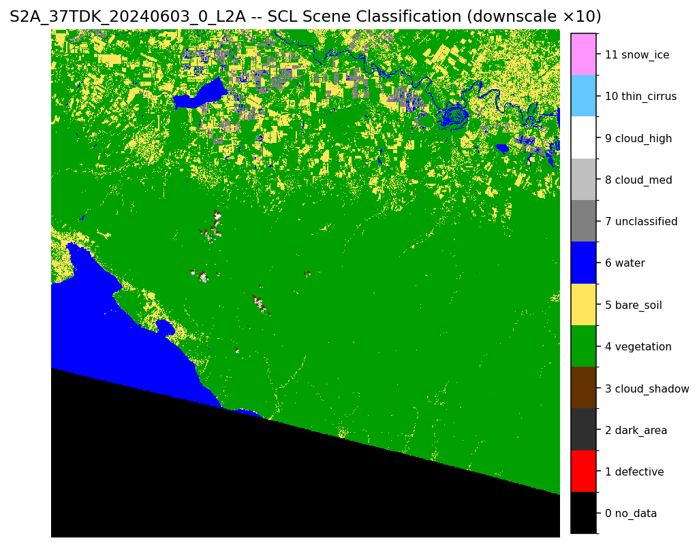
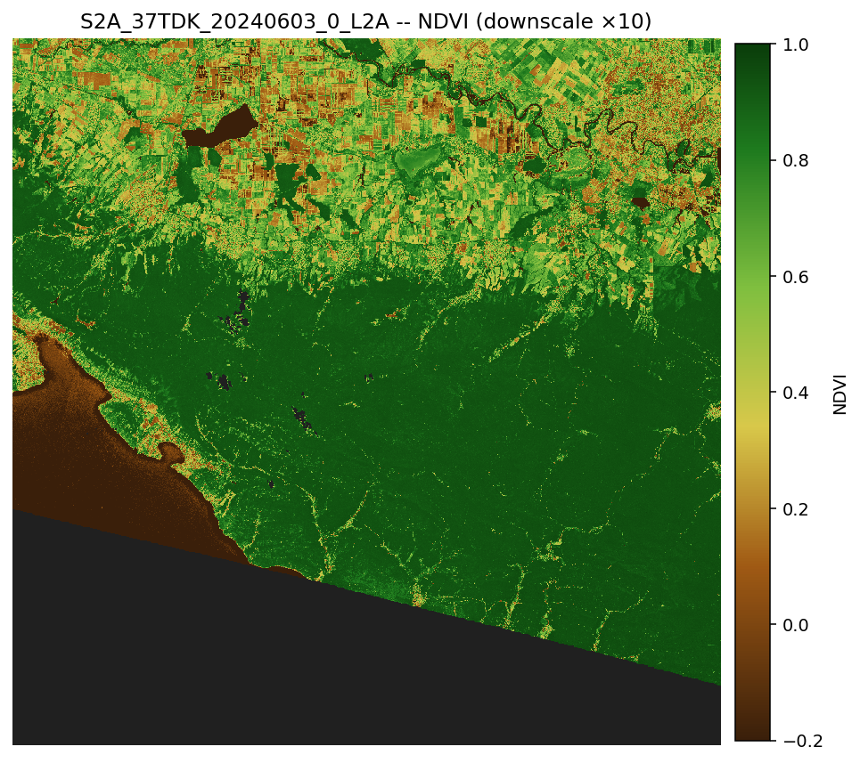
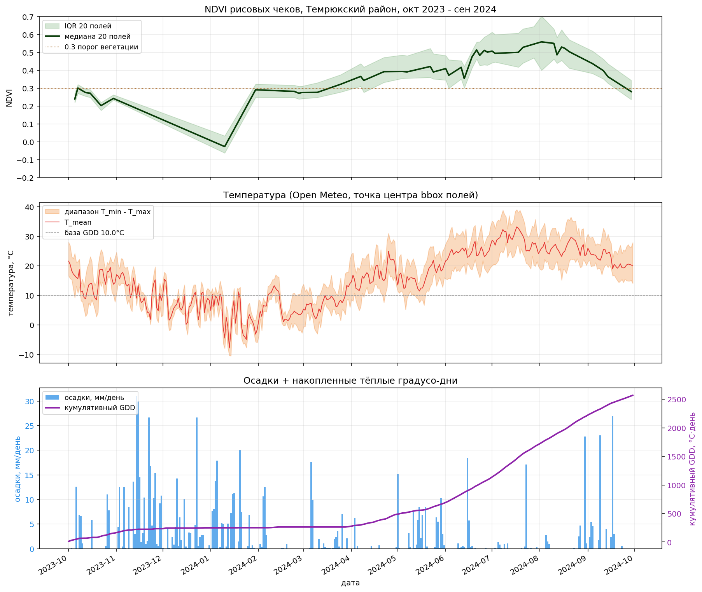
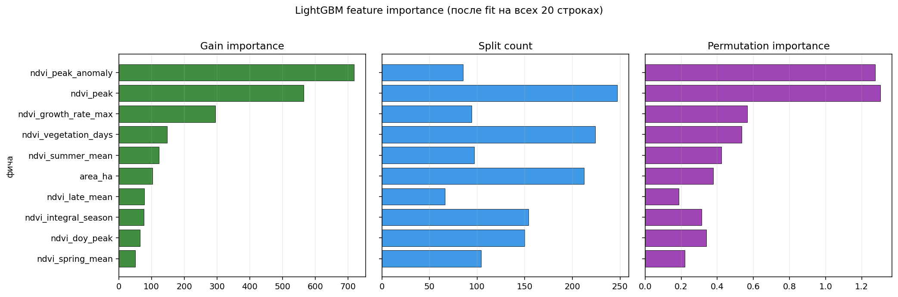
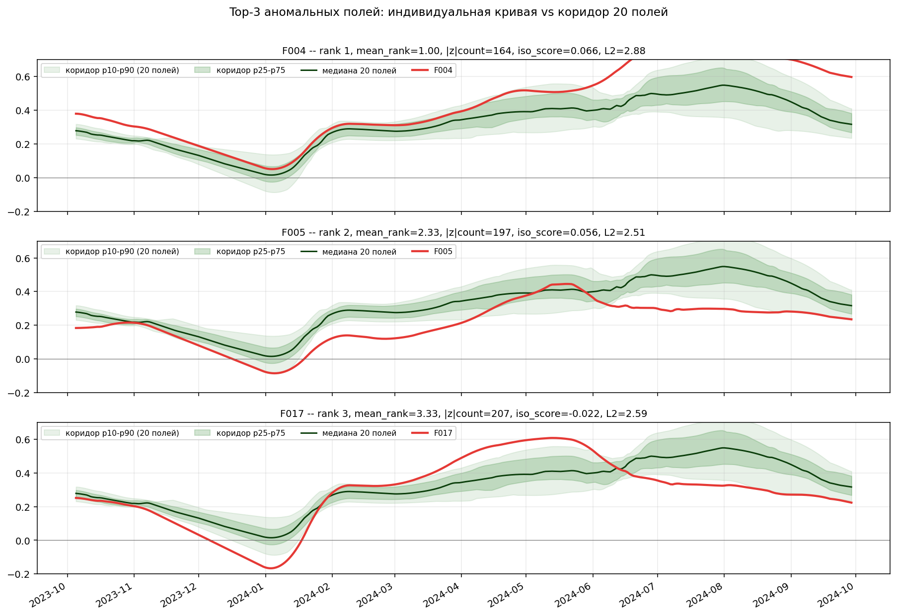

# AgroNDVI

[](https://www.python.org/)
[](https://lightgbm.readthedocs.io/)
[](https://streamlit.io/)
[](https://rasterio.readthedocs.io/)
[](https://evalentyuk.github.io/AgroNDVI/)
[](https://opensource.org/licenses/MIT)
[](https://github.com/EValentyuk/AgroNDVI/commits/main)
[](https://github.com/EValentyuk/AgroNDVI)

Пет-проект по спутниковому мониторингу полей и прогнозу урожайности.

Принимает координаты полей в Краснодарском крае, скачивает Sentinel-2 за сезон, считает NDVI, объединяет с погодой и историческими данными урожайности, выдаёт прогноз ц/га и подсвечивает аномальные поля. Streamlit-приложение с интерактивной картой.

> **Главный методологический сигнал.** На датасете 20 точек простая LinearRegression на одной фиче `ndvi_peak` побеждает LightGBM на 18 фичах: MAPE 2.95% vs 4.39%, R² 0.70 vs 0.32. Это включено в отчёт **как есть** -- демонстрация зрелого понимания bias-variance trade-off, а не подхода «лишь бы LightGBM запустить». Разбор в [docs/experiments/2026-05-26-lgb-baseline.md](docs/experiments/2026-05-26-lgb-baseline.md), полный отчёт для работодателя -- в [docs/portfolio-report.md](docs/portfolio-report.md).

## Демо в одном окне


20 рисовых чеков Темрюкского района Краснодарского края, наложенных на NDVI-карту от 3 июня 2024. Цвет от охристого (вода / голая земля) до тёмно-зелёного (густая растительность). NDVI каждого поля подписан на самом полигоне.

## Что внутри

- **Спутниковые снимки:** Sentinel-2 L2A, 10 м/px, каждые 5 дней. Скачиваются через AWS Element 84 STAC (бесплатно, без VPN, без регистрации; Copernicus заблокирован для РФ);
- **NDVI:** классический индекс вегетации (B08 - B04) / (B08 + B04), усреднённый по границам полей;
- **Time-series ML:** LightGBM + 4 baseline-модели на исторических данных, Leave-One-Out CV, прогноз урожайности с метрикой MAPE;
- **Anomaly detection:** 3 независимых метода (pointwise z-score + IsolationForest + L2-distance), объединение через mean-rank;
- **UI:** Streamlit + folium + plotly. Карта 20 полей раскрашена по предсказанной урожайности, top-K аномалий в красной рамке. По клику -- индивидуальная кривая NDVI в коридоре 20 полей, погода сезона, OSM-метаданные.

## Ключевые цифры

- **45 снимков** Sentinel-2 за полный сезон октябрь 2023 -- сентябрь 2024;
- **20 рисовых чеков** Темрюкского района из OpenStreetMap, площадь 722-1488 га;
- **900 точек** NDVI time-series (20 × 45), **98.9%** валидных после SCL-маски;
- **NDVI амплитуда сезона 0.587** -- от затопления чеков (-0.03 в январе) до пика биомассы (0.56 в августе);
- **MAPE 2.95%** -- лучший baseline (LinearRegression на одной фиче), LOO-CV;
- **End-to-end 10 минут** на полный прогон pipeline.

Полная сводка -- в [docs/metrics.md](docs/metrics.md).

## Иллюстрации

|  |  |
|:---:|:---:|
| SCL Scene Classification (зелёное -- вегетация, синее -- вода, жёлтое -- голая земля) | NDVI всего tile 110×110 км после SCL-маски |

|  |
|:---:|
| Сезонная динамика NDVI по 20 полям, медиана + IQR. Видна классическая рисовая кривая. |

|  |
|:---:|
| NDVI + температура + GDD/осадки на одной шкале. Зимний провал NDVI совпадает с минусовыми температурами. |

|  |  |
|:---:|:---:|
| 5 моделей × LOO-CV: baseline линейная регрессия на одной фиче бьёт LightGBM. | Top-фичи LightGBM. Все weather имеют gain=0 (константа для 20 полей). |

|  |
|:---:|
| Heatmap z-score: видно «когда именно» поля отклонялись от медианы. F004 сплошной красный (выше нормы), F005 сплошной синий (ниже). |

|  |
|:---:|
| Top-3 аномалии: F004 (чемпион), F005 (отстающий), F017 (сдвинутый сезон). |

## Стек

- Python 3.13, venv в `.venv/`;
- **Геоданные:** `rasterio 1.5` + GDAL 3.12, `geopandas 1.1`, `shapely 2.1`, `pyproj 3.7`, `folium 0.20`;
- **ML:** `lightgbm 4.6`, `scikit-learn 1.8`;
- **UI:** `streamlit 1.57`, `streamlit-folium 0.27`, `plotly 6.7`;
- **API клиенты:** `pystac-client`, `osm2geojson`, `requests`;
- **Источники данных:** AWS Element 84 STAC, Open Meteo, NASA POWER, OpenStreetMap. Все бесплатно, доступны из РФ без VPN.

## Запуск

### 0. Окружение (один раз)

```powershell
cd c:\Projects\AgroNDVI
python -m venv .venv
.venv\Scripts\pip install -r requirements.txt
```

### 1. Запустить готовый UI (если артефакты уже собраны)

```powershell
.venv\Scripts\streamlit.exe run src\streamlit_app.py
```

Открывается http://localhost:8501.

### 2. Полный прогон pipeline с нуля

```powershell
.\run_pipeline.ps1
```

Скрипт по очереди вызывает все этапы (см. [run_pipeline.ps1](run_pipeline.ps1)). Полный прогон ~10 минут.

### 3. Запустить отдельные этапы

```powershell
# 1. найти серию Sentinel-2 за год
.venv\Scripts\python.exe -X utf8 src\find_sentinel.py --series --tile 37TDK --from 2023-10-01 --to 2024-09-30 --max-cloud 20

# 2. скачать границы полей из OSM
.venv\Scripts\python.exe -X utf8 src\fetch_osm_fields.py

# 3. скачать погоду
.venv\Scripts\python.exe -X utf8 src\fetch_weather.py

# 4. посчитать серию NDVI по полям (7-10 минут, 6 параллельных потоков)
.venv\Scripts\python.exe -X utf8 src\ndvi_series.py --workers 6

# 5. построить фичи + синтетический таргет
.venv\Scripts\python.exe -X utf8 src\feature_engineering.py

# 6. обучить LightGBM + baselines + LOO-CV
.venv\Scripts\python.exe -X utf8 src\train_lgb.py

# 7. anomaly detection (3 метода)
.venv\Scripts\python.exe -X utf8 src\anomaly.py

# 8. построить все визуализации
.venv\Scripts\python.exe -X utf8 src\plot_ndvi_series.py
.venv\Scripts\python.exe -X utf8 src\plot_weather_ndvi.py
.venv\Scripts\python.exe -X utf8 src\plot_model_results.py
.venv\Scripts\python.exe -X utf8 src\plot_anomaly.py

# 9. UI
.venv\Scripts\streamlit.exe run src\streamlit_app.py
```

## Структура

```
.
├── README.md                       -- этот файл
├── requirements.txt                -- 70+ пакетов
├── run_pipeline.ps1                -- end-to-end запуск
├── AgroNDVI-results.md             -- технический лог по дням
├── AgroNDVI-journal.md             -- параллельный лог простым языком
├── CLAUDE.md / MEMORY.md           -- инструкции для Claude Code
│
├── src/                            -- 12 Python-модулей
│   ├── find_sentinel.py            -- STAC search с retry
│   ├── fetch_osm_fields.py         -- Overpass API
│   ├── fetch_weather.py            -- Open Meteo + NASA POWER
│   ├── explore_sentinel.py         -- чтение удалённого COG
│   ├── ndvi.py                     -- NDVI на полном tile
│   ├── ndvi_series.py              -- параллельная серия NDVI по окну
│   ├── zonal_stats.py              -- усреднение NDVI по полям
│   ├── feature_engineering.py      -- 18 фичей + синтетический yield
│   ├── train_lgb.py                -- LightGBM + 4 baseline + LOO-CV
│   ├── anomaly.py                  -- 3 метода детекции
│   ├── plot_*.py                   -- 4 скрипта визуализации
│   ├── streamlit_app.py            -- интерактивный UI
│   └── smoke_test.py               -- проверка стека
│
├── notebooks/
│   └── 02_ndvi_explore.ipynb       -- exploratory ноутбук
│
├── docs/
│   ├── brief.md                    -- постановка задачи + глоссарий
│   ├── architecture.md             -- C4-диаграммы Mermaid
│   ├── metrics.md                  -- сводка метрик
│   ├── portfolio-report.md         -- отчёт для работодателя
│   ├── sentinel-download.md        -- инструкция по доступу к Sentinel-2
│   ├── experiments/
│   │   ├── 2026-05-26-lgb-baseline.md   -- разбор ML эксперимента
│   │   └── 2026-05-26-anomaly.md        -- разбор anomaly detection
│   └── images/                     -- 10 скриншотов для README
│
├── data/                           -- НЕ в git (gitignored)
│   ├── catalog/                    -- STAC JSON
│   ├── fields/                     -- GeoJSON полей (попадает в git как исключение)
│   ├── weather/                    -- CSV погоды
│   ├── processed/                  -- NDVI series, features, anomaly
│   └── preview/                    -- 15 PNG + 3 HTML
│
└── models/                         -- НЕ в git
    └── lgb_yield.pkl               -- финальная модель LightGBM
```

## Документация

- [docs/brief.md](docs/brief.md) -- постановка задачи, план на 7-10 дней, риски, глоссарий из 17 терминов;
- [docs/architecture.md](docs/architecture.md) -- C4-диаграммы (Context + Container + Component) через Mermaid;
- [docs/metrics.md](docs/metrics.md) -- сводная таблица метрик: данные / NDVI / модель / аномалии / время;
- [docs/portfolio-report.md](docs/portfolio-report.md) -- отчёт для работодателя с привязкой к навыкам системного анализа;
- [docs/sentinel-download.md](docs/sentinel-download.md) -- доступ к Sentinel-2 через AWS Element 84 STAC;
- [docs/experiments/2026-05-26-lgb-baseline.md](docs/experiments/2026-05-26-lgb-baseline.md) -- эксперимент ML: 5 моделей, LOO-CV, feature importance;
- [docs/experiments/2026-05-26-anomaly.md](docs/experiments/2026-05-26-anomaly.md) -- эксперимент anomaly: 3 метода, согласованность.

## Связанные проекты

- **MiniProctor** (https://github.com/EValentyuk/MiniProctor) -- первый пет-проект на CV + Streamlit. Метрики precision/recall/F1, fine-tune YOLO, история про доменный сдвиг.

## Статус

В разработке. Старт: 2026-05-25. Финализация и публикация: 2026-05-26 (день 10 плана).

## Лицензия и контакты

- Автор: Валентюк Евгений Григорьевич, e.valentyuk@yandex.ru;
- GitHub: https://github.com/EValentyuk;
- Код -- MIT, документация -- CC-BY 4.0.
