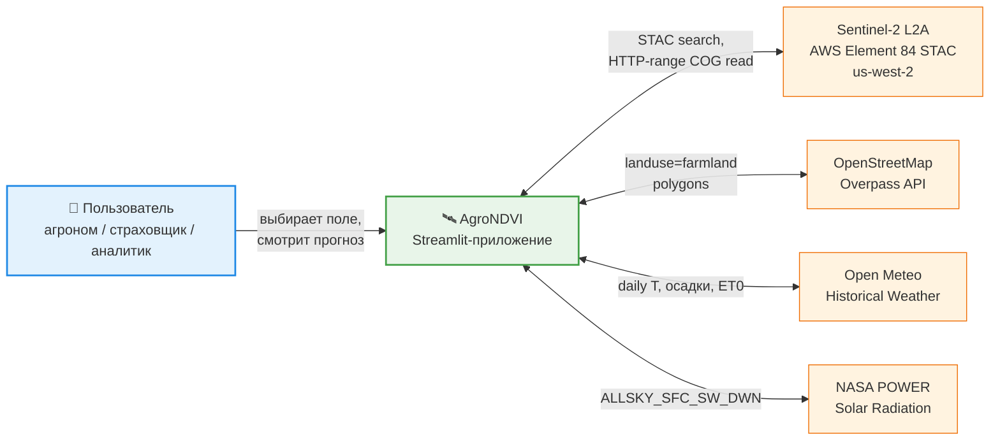
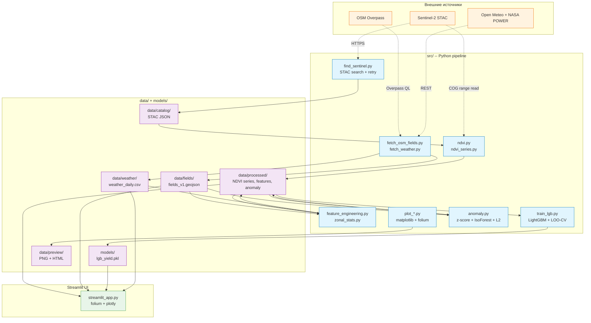
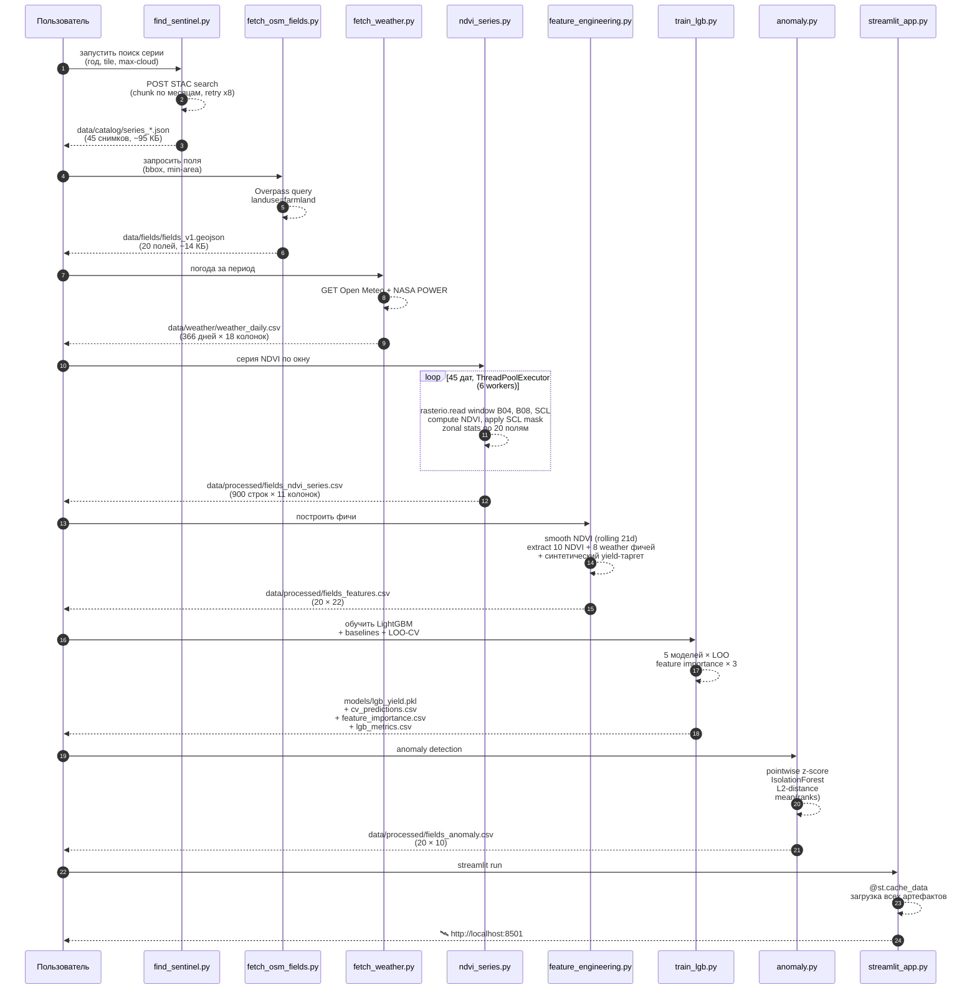
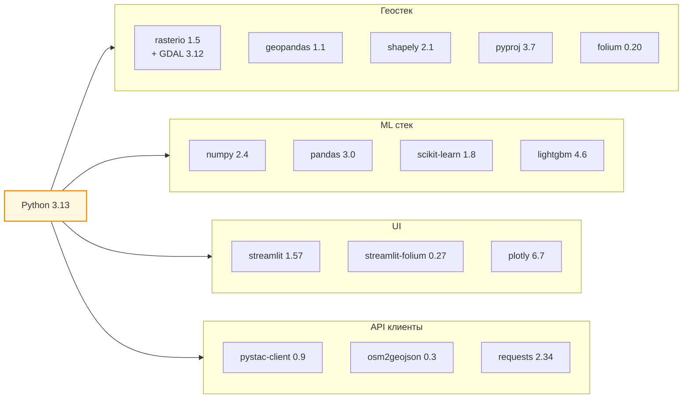

# Архитектура AgroNDVI

Диаграммы по уровням C4 (Context -> Container -> Component) через Mermaid. GitHub рендерит их прямо в браузере.

## Уровень 1: Context

Окружение проекта и внешние источники данных.

**Ключевые решения:**
- Все внешние источники бесплатные и доступны из РФ без VPN;
- Sentinel-2 берём через AWS, а не Copernicus -- последний под санкциями для РФ;
- Данные кэшируются локально, после первого прогона приложение работает без интернета.

## Уровень 2: Containers

Что внутри проекта -- основные слои данных и кода.

**Слои:**
- **External** -- 4 источника данных, все бесплатные;
- **Pipeline** -- 11 Python-скриптов, разделены по ответственности (download / NDVI / feature engineering / ML / anomaly / visualization);
- **Storage** -- 6 категорий артефактов; `data/` под `.gitignore`, на GitHub попадает только `data/fields/*.geojson` (объёмом меньше 20 КБ);
- **UI** -- Streamlit + folium + plotly, читает финальные артефакты, не вычисляет.

## Уровень 3: Components -- pipeline сценарий

Подробный flow одного полного прогона.

## Ключевые архитектурные решения

| **Решение** | **Что выбрали** | **Почему** |
|:---|:---|:---|
| Источник Sentinel-2 | AWS Element 84 STAC | Бесплатно, без регистрации, доступно из РФ. Альтернатива (Copernicus) заблокирована санкциями. |
| Формат снимков | COG + HTTP-range read | Не нужно качать 1 ГБ tile целиком, читаем окно над полями (~5 МБ). 30-кратное сокращение трафика. |
| Источник границ полей | OSM `landuse=farmland` | Реальные данные, не выдуманные. Доступ через Overpass API без VPN. |
| Source granularity | 20 полей одного района одного года | Pet-проект для портфолио. Для реальной задачи нужно multi-year + multi-region. |
| Синхронизация | Файлы, не БД | Простота, наглядность. Каждый этап читает CSV/GeoJSON предыдущего. |
| Модель ML | LightGBM + LinearRegression baseline | Сравниваем гипотезы. На 20 строках baseline побеждает (см. [docs/experiments/2026-05-26-lgb-baseline.md](experiments/2026-05-26-lgb-baseline.md)). |
| Anomaly detection | 3 независимых метода + объединение | Устойчивость к выбору алгоритма. Согласованность через Spearman ρ. |
| UI | Streamlit + folium + plotly | Быстрый интерактив без фронтенд-разработки. |
| HTTP retry | Собственная функция _post_with_retry | pystac-client падал на нестабильном канале РФ -> us-west-2. Сделали 8 попыток с экспоненциальным backoff. |
| Pandas-pyarrow конфликт | `pd.options.future.infer_string = False` | На Windows pandas 3.0 + pyarrow 24 даёт access violation при `read_csv`. |

## Зависимости

Полный список -- в [requirements.txt](../requirements.txt).
