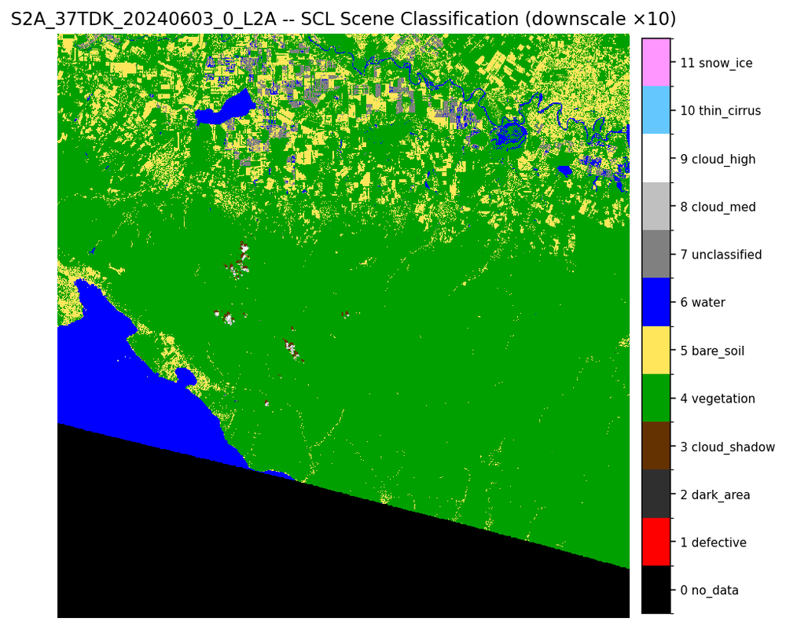
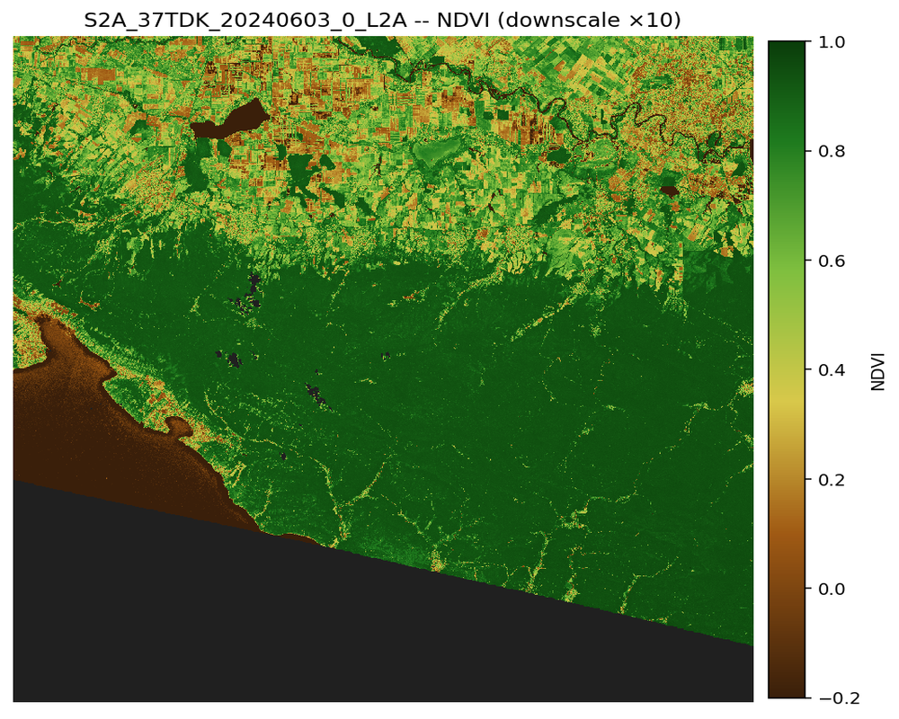

# 🔀 Сравнение SCL vs NDVI на одном tile

Слайдер ниже сравнивает два разных представления одного и того же спутникового снимка Sentinel-2 L2A (3 июня 2024, tile 37TDK).

- **Слева (SCL):** Scene Classification Layer -- категориальная маска: вегетация / голая земля / вода / облака. Это «сырая» классификация пикселей самим спутником;
- **Справа (NDVI):** наш вычисленный индекс вегетации после маскирования по SCL. Зелёное -- активная биомасса.

**Перетащи разделитель** слева-направо, чтобы увидеть, как SCL-категории трансформируются в количественный сигнал NDVI.

<link rel="stylesheet" href="https://cdn.knightlab.com/libs/juxtapose/latest/css/juxtapose.css">

  
  

## Что видно

- **Юго-западная часть** (нижний треугольник): SCL пометил это `no_data` -- UTM-крой tile. На NDVI там тоже маскировано (тёмно-серый/чёрный);
- **Чёрное море и лиманы** (синий на SCL): NDVI отрицательный (тёмно-коричневый);
- **Кавказские предгорья** (зелёный SCL `vegetation`): NDVI 0.7-0.9 -- лесные массивы;
- **Северная часть -- рисовые чеки и кубанские поля** (микс `vegetation` и `bare_soil` на SCL): NDVI разнородный, от 0.2 (поля под паром) до 0.7 (рис в фазе активного роста);
- **Анапа / Темрюк** (yellow `bare_soil`): NDVI низкий -- городская застройка и пляжи.

## Зачем это вообще

SCL даёт «карту качества» -- что мы видим как тип поверхности. NDVI даёт «карту состояния» -- насколько активно растения фотосинтезируют. Вместе эти два слоя позволяют:

1. **Отсеять мусор перед расчётом NDVI** (облака, тени, снег, no_data) -- сделано автоматически в `src/ndvi.py`;
2. **Не маскировать воду в рисовых чеках** -- класс 6 (water) валиден для затопленных полей, это **не «нет данных», а агрономическое состояние**;
3. **Дать агроному двойное доказательство:** «вот это поле -- сельхозземля (SCL=4), и оно в фазе пика биомассы (NDVI=0.85)».

[← На главную]({{ '/' | relative_url }})
