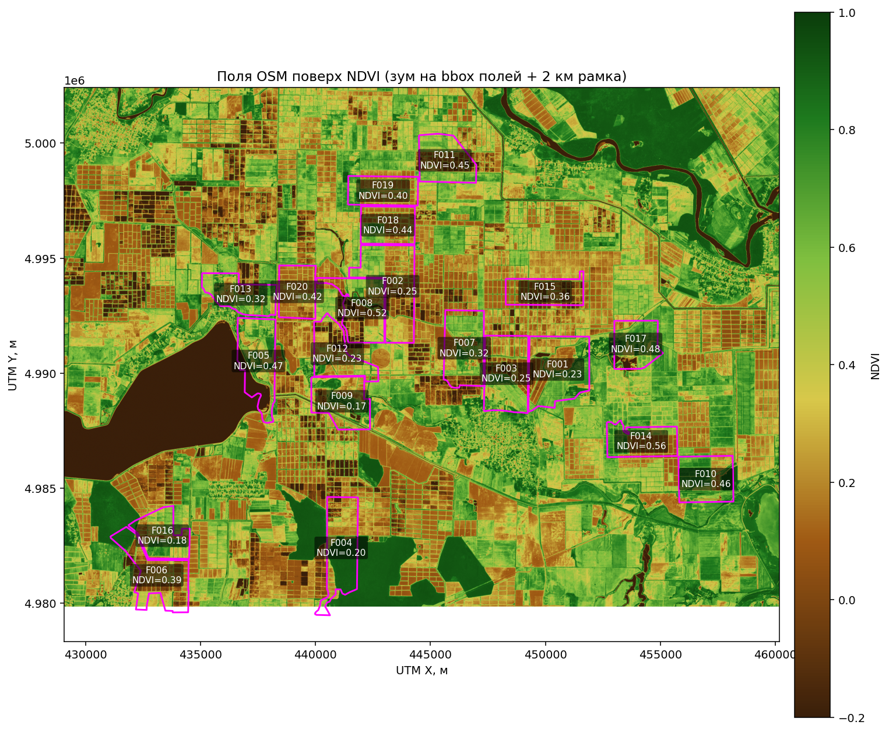
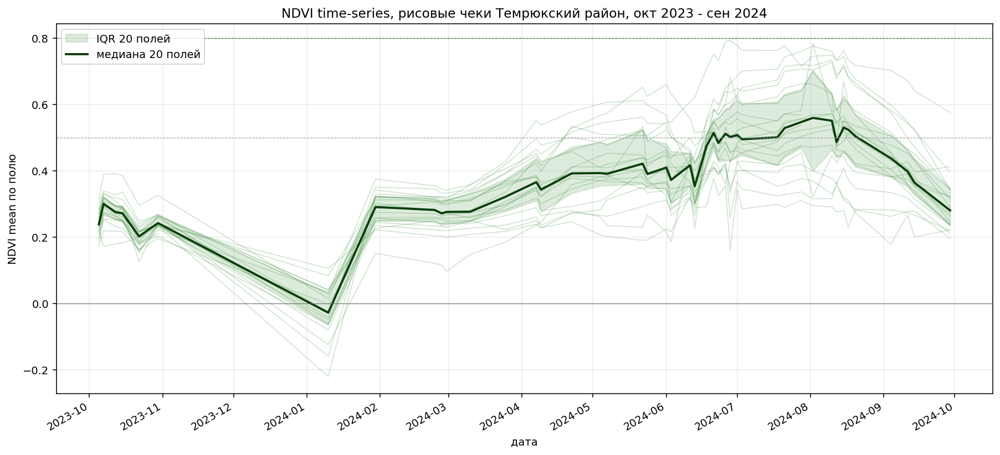
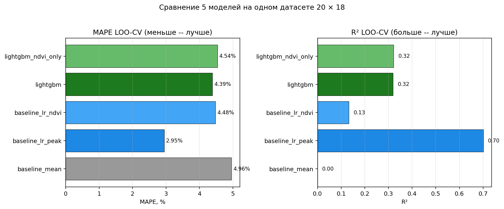
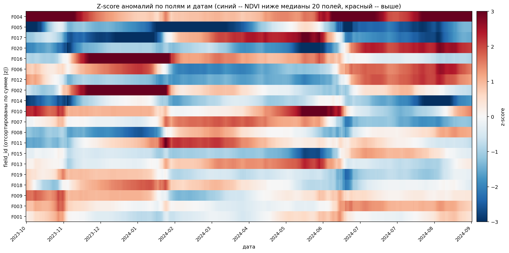

# AgroNDVI · документация

Спутниковый мониторинг рисовых полей и прогноз урожайности. Pet-проект для ML/DS-портфолио в банковский агро-сегмент.

> **Главный методологический сигнал.** На датасете 20 точек простая LinearRegression на одной фиче `ndvi_peak` побеждает LightGBM на 18 фичах: MAPE 2.95% vs 4.39%, R² 0.70 vs 0.32. Включено в отчёт **как есть** -- демонстрация зрелого понимания bias-variance trade-off, а не подхода «лишь бы LightGBM запустить». Разбор -- в [эксперимент-отчёте LightGBM](experiments/2026-05-26-lgb-baseline).

## Главное

- 🛰️ **[Отчёт для работодателя]({{ 'portfolio-report' | relative_url }})** -- что внутри, ключевые цифры, методологические решения, привязка к навыкам системного анализа;
- 🎤 **[Презентация · PDF](presentation.pdf)** -- 21 слайд для устного рассказа;
- 🎤 **[Презентация · PowerPoint](presentation.pptx)** -- то же в редактируемом формате;
- 📊 **[Сводка метрик]({{ 'metrics' | relative_url }})** -- все числовые результаты проекта в одной таблице;
- 🏗️ **[Архитектура (C4-диаграммы)]({{ 'architecture' | relative_url }})** -- Context, Container и Component уровни через Mermaid;
- 📋 **[Постановка задачи]({{ 'brief' | relative_url }})** -- цели, риски, план, глоссарий из 17 терминов.

## Эксперимент-отчёты

- 🧪 **[ML-baseline и LightGBM]({{ 'experiments/2026-05-26-lgb-baseline' | relative_url }})** -- 5 моделей × LOO-CV, feature importance, открытое обсуждение почему simple победил complex;
- 🔍 **[Anomaly detection]({{ 'experiments/2026-05-26-anomaly' | relative_url }})** -- 3 независимых метода (z-score + IsolationForest + L2), Spearman согласованность ≥ 0.70 между парами.

## Технические детали

- 🌐 **[Доступ к Sentinel-2]({{ 'sentinel-download' | relative_url }})** -- AWS Element 84 STAC, обход санкционного блока Copernicus.

## Иллюстрации

|  |
|:---:|
| 20 рисовых чеков Темрюкского района Краснодарского края поверх NDVI |

|  |
|:---:|
| Сезонная динамика NDVI: классическая «горбатая» кривая риса |

|  |
|:---:|
| 5 моделей × LOO-CV: baseline побеждает LightGBM на N=20 |

|  |
|:---:|
| Z-score аномалий: видно «когда» поле отклонилось от группы |

## Ключевые цифры

- **45 снимков** Sentinel-2 за полный сезон октябрь 2023 -- сентябрь 2024;
- **20 рисовых чеков** Темрюкского района из OpenStreetMap, 700-1500 га каждый;
- **900 точек** NDVI time-series, **98.9% валидных** после SCL-маски;
- **MAPE 2.95%** у лучшего baseline (LOO-CV);
- **End-to-end 10 минут** на полный прогон pipeline.

## Связанные

- 💻 **[Исходный код на GitHub](https://github.com/EValentyuk/AgroNDVI)** -- pipeline, Streamlit-приложение, эксперимент-отчёты;
- 🤖 **[MiniProctor](https://github.com/EValentyuk/MiniProctor)** -- первый пет-проект (CV-прокторинг).

## Контакты

- ✉️ **Email:** [e.valentyuk@yandex.ru](mailto:e.valentyuk@yandex.ru)
- 🐱 **GitHub:** [github.com/EValentyuk](https://github.com/EValentyuk)

Открыт к обсуждениям и собеседованиям в ML/DS-команды банковского агро-сегмента, агрохолдингов, страховых, геотех-стартапов.
